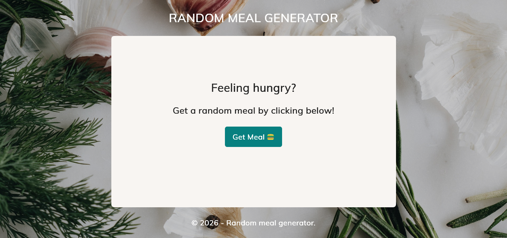
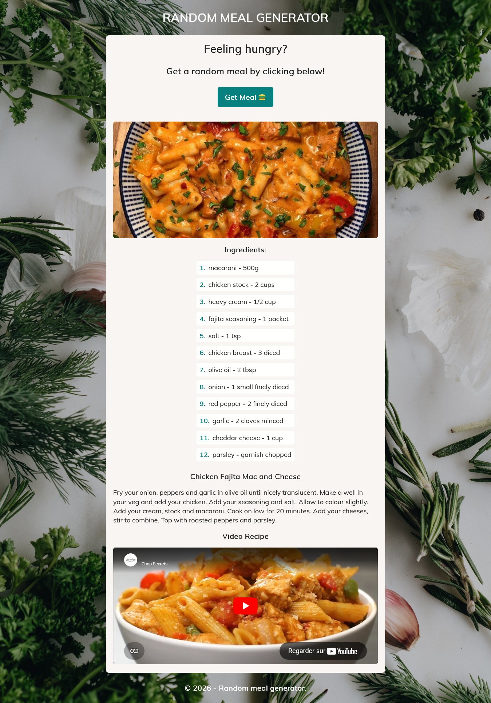

## RANDOM MEAL GENERATOR 🍔

## Le challenge

Création du site web : random meal generator en HTML5, CSS3 et JavaScript. Cliquez sur le bouton "Get Meal" pour voir apparaître la photo, les ingrédients, la recette et la vidéo (s'il y en a une) d'un plat choisi de manière aléatoire.

## Démonstration

Lien vers le projet : https://aperbet56.github.io/random_meal_generator/

## Projet développé avec

- Utilisation des balises sémantiques HTML5
- CSS3
- Flexbox
- Animations css (transition)
- Importation de la police "Muli"
- Utilisation d'un normaliseur : le fichier normalize.css
- Desktop first
- Page web responsive
- Commentaires HTML
- Commentaires CSS
- JavaScript
- Code JavaScript commenté
